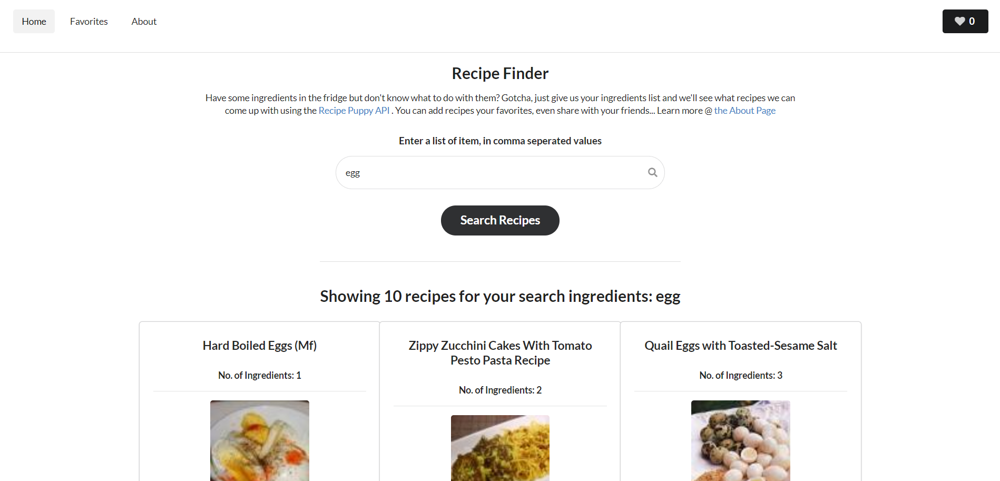

# Recipe Finder

This is a small web app for searching recipes and saving them to a list of favorites. See live demo here: http://recipe-suit.surge.sh

##### Home Page

##### Favorites Page

### Features

0. Users can use the input field to search for recipes
1. Based on the ingredients, the recipes are queried from the [Recipe Puppy](http://www.recipepuppy.com/) API
1. Recipes are shown as cards with relevant data, (i.e. thumbnail, details, link to recipe, etc.) and if thumbnail is not available, a message is shown saying: `thumbnail not available.`
1. Users can add and remove Favorites
1. Favorites are stored in browser's localstorage, so it's persistent between page views
1. Users can view the list of all favorite items in the favorites page
1. Users can share recipes on twitter, or get the link and share manually
1. Easy Navigation and Pagination

### Technical Details

1. Site is fully responsive on mobile devices.
1. Has a very small code footprint
1. All errors and edge cases handled gracefully
1. Clean, tidy and well commented code
1. Semantic UI is used for styling
1. JQuery for DOM manipulation
1. For easier code management, many files were created

### Running Locally

Since no backend technology is geing used for, running this locally is fairly easy:

1. Open up your terminal and type: `git clone https://github.com/nfuad/recipe-finder.git`
2. Then enter into the cloned repo from the terminal using: `cd recipe-finder` (assuming the directory name wasn't changed while cloning)
3. Open the index.html in the default browser

### Live Demo:

Checkout the Live demo here: [http://recipe-suit.surge.sh](http://recipe-suit.surge.sh)

### Bug Reports:

Please report any bugs [here](https://github.com/nfuad/recipe-finder/issues).

### License

[MIT](./LICENSE)
